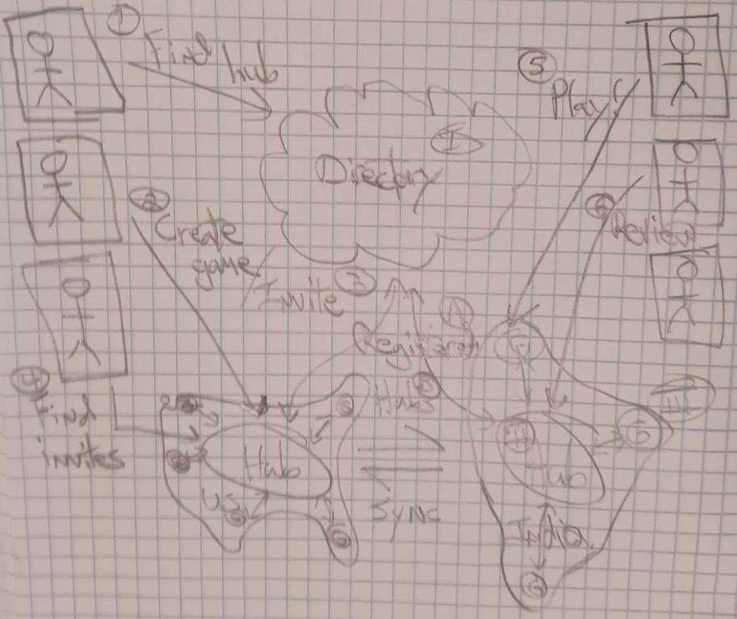
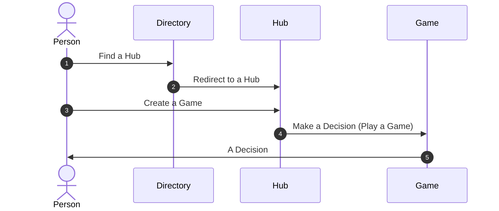
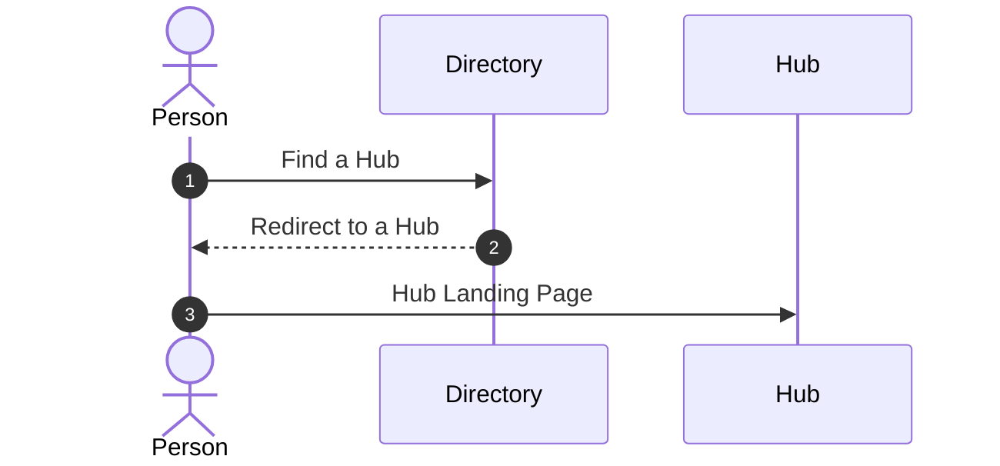
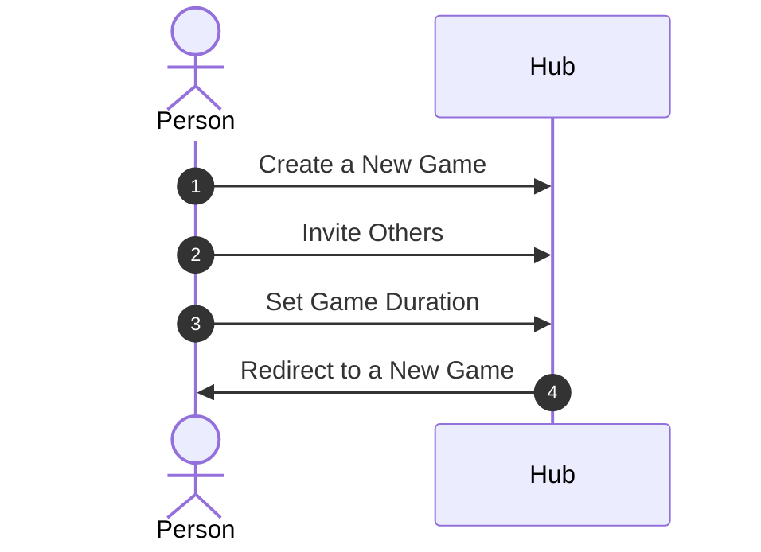

# `Distributed Rock Paper Scissors` Game

This is the requirements document for `Distributed Rock Paper Scissors` - `DRPS`.

| Title | Code Name | Author | Date | Version | State |
|-------|------|--------|------|-------|------|
| `Distributed Rock Paper Scissors` | DRiPS | Q | 12/22/2022 | 0.1 | `DRAFT` |

## Motivation

Rock Paper Scissors is a fun game and can also be used as a decision-making process. Choosing between 2 options is actually not always clear. At some point a decision just needs to be made so progress towards the goal does not become stalled.

**`Distributed Rock Paper Scissors` makes the choosing simple, quick and fun!**

> NOTE: `DRPS` is only a method for choosing between previous generate options which are consider roughtly equivalent and the team cant seem to come to a consensus on.

## Influences

Due to the dispursed geographic nature of our team, we need an asynchronous distributed decision-making process.

Obviously the Internet and the *Web* are distributed systems and thus we will be modeling and designing from this space.

The development team also has skills and experience with distributed architectures and tools, including but not limited to:

* Microservices
* Elixir/Erlang/OTP

## Context

Since our main influence is the Internet/*Web* we will be assuming and requiring the following of the decision-makers:

* Internet access
* Browser

The HW environment shall be:

* A cloud service provider
* Locally hosted servers

The SW tools shall be:

* A *discovery* solution (hosted in above cloud)
* *Hubs* written Elixir/Phoenix
* *Game* microserves written in Racket

## Design

### Sketches

Initial design was sketched and is as follows:

<table border="2"><tr>
<td></td>
<td valign="top"><table>
  <tr>
    <th>Services</th>
    <th>Service <code>&lt;-&gt;</code> Service</th>
    <th>Person <code>&lt;-&gt;</code> Service</th>
  </tr>
  <tr>
    <td valign="top">
      <ol type="I">
        <li>Directory</li>
        <li>Hub(s)</li>
        <li>Game(s)</li>
      </ol>
    </td>
    <td valign="top">
      <ol type="A">
        <li>Hub Registry</li>
        <li>Hub Syncronization</li>
      </ol>
    </td>
    <td valign="top">
      <ol type="1">
        <li>Hub Discovery</li>
        <li>Game Creation</li>
        <li>Game Invite</li>
        <li>Game Invitation</li>
        <li>Game Play(!)</li>
        <li>Game Review</li>
      </ol>
    </td>
  </tr>
</table></td>
</tr></table>

#### Service Details

##### Directory

The directory service is the entry point into DRPS. It will simply list the available Hubs for the team to choose.

##### Hub

Hubs are where the team can:

1. Start a decision process (game)
2. Find invitations to and participate in a decision process (game)
3. Review previous decisions (games)

##### Game

Games are where a decision is made. A game is ephemeral, meaning a Game service is created when someone on the team starts a decision-making process and shutdowns based on the criteria they set on creation.

Other members of the team are invited and then can participate is the decision-making by making their play.

#### Decision (Game) Sequence Diagram

### Use Cases

#### Find a Hub

The Hub service:

1. Is where a decision-making game is started
1. The list of current decision-making games, some of which the user can join having been invited
1. The list of past decisions made

##### Activity Diagram

#### Create a New Game

`DESCRIPTION`

##### Activity Diagram

## Specification

## Validation