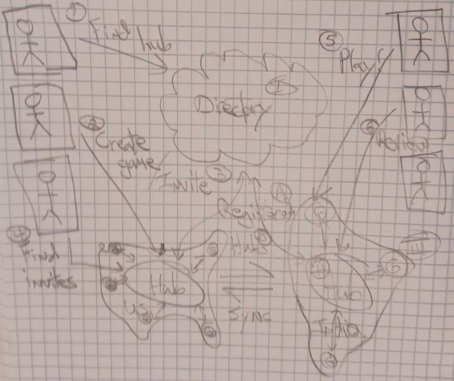

# `Distributed Rock Paper Scissors` Game

This is the requirements document for `Distributed Rock Paper Scissors` - `DRPS`.

| Title | Author | Date | Version | State |
|-------|--------|------|-------|------|
| `Distributed Rock Paper Scissors` | Q | 12/22/2022 | 0.1 | `DRAFT` |

## Motivation

Rock Paper Scissors is a fun game and can also be used as a decision-making process. Choosing between 2 options is actually not always clear. At some point a decision just needs to be made so progress towards the goal does not become stalled.

**`Distributed Rock Paper Scissors` makes the choosing simple, quick and fun!**

> NOTE: `DRPS` is only a method for choosing between previous generate options which are consider roughtly equivalent and the team cant seem to come to a consensus on.

## Influences

Due to the dispursed geographic nature of our team, we need an asynchronous distributed decision-making process.

Obviously the Internet and the *Web* are distributed systems and thus we will be modeling and designing from this space.

The development team also has skills and experience with distributed architectures and tools, including but not limited to:

* Microservices
* Elixir/Erlang/OTP

## Context

Since our main influence is the Internet/*Web* we will be assuming and requiring the following of the decision-makers:

* Internet access
* Browser

The HW environment shall be:

* A cloud service provider
* Locally hosted servers

The SW tools shall be:

* A *discovery* solution (hosted in above cloud)
* *Hubs* written Elixir/Phoenix
* *Game* microserves written in Racket

## Design

### Sketches

Initial design was sketched and is as follows:

<table border="2"><tr>
<td></td>
<td valign="top"><table>
  <tr>
    <th>Services</th>
    <th>adf</th>
  </tr>
  <tr>
    <td>
      <ol type="A">
        <li>adsf</li>
        <li>adf</li>
      </ol>
    </td>
  </tr>
</table></td>
</tr></table>

#### Decision Sequence Diagram

### Use Cases

#### Use-Case-1

`DESCRIPTION`

##### Activity Diagram

## Specification

## Validation